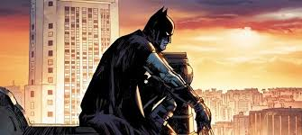

        <!-- Projeto 3 -->
        

            

                
                

                    <h5 class="card-title">Vídeo do youtube
                    </h5>
                    
Esse é um vídeo postado no youtube onde vários jovens estão assistindo atualmente.
                    

                    <button type="button" class="btn btn-link" data-bs-toggle="modal" data-bs-target="#modal3">Veja
                        o projeto</button>
                

            

        

    

</main>

<!-- Modal 1 -->

    

        

            

                <h5 class="modal-title">Minha Biblioteca: Um livro bom</h5>
                <button type="button" class="btn-close" data-bs-dismiss="modal" aria-label="Close"></button>
            

            

                
O projeto é uma foto de livros que estão em alta atualmente e que estimulam a curiosidade e cérebro do jovem.

                
            

            

                <a href="https://femascheti.github.io/minhas-leituras/">Ver projeto ao vivo</a>
                <a href="https://github.com/femascheti/minhas-leituras">Ver código do projeto</a>
            

        

    

<!-- Modal 2 -->

    

        

            

                <h5 class="modal-title">Minha Biblioteca: Uma Webpage Personalizada</h5>
                <button type="button" class="btn-close" data-bs-dismiss="modal" aria-label="Close"></button>
            

            

                
O jogo tem o objetivo de caçar, coletar e guardar ovos de páscoa, você pode andar pelo mapa e subi em árvores.
                

                
O projeto foi enviado no scrath e é um jogo sobre um humano caçador de ovos.
                

                
            

            

                <a href="https://scratch.mit.edu/projects/676718209/">Ver o jogo ao
                    vivo</a>
                <a href="https://scratch.mit.edu/users/Beep_Bob/">Ver perfil do criador</a>
            

        

    

<!-- Modal 3 -->

    

        

            

                <h5 class="modal-title">Minha Biblioteca: Um vídeo bom</h5>
                <button type="button" class="btn-close" data-bs-dismiss="modal" aria-label="Close"></button>
            

            

                
O vídeo é sobre um Pica Pau travesso que adora bagunçar, vários jovens assistem como lazer seu desenho..

                
            

            

                <a href="https://www.youtube.com/watch?v=1TYPjw6aYZI">Ver o vídeo</a>
            

        

    

<footer class="container py-5">
    <h2>Entre em contato</h2>
    

        <i class="bi bi-github"></i>
        <a href="https://github.com/FreitasMurilo1A">GitHub</a>
    

    
© Copyright 2024. Produzido por Murilo Zandonadi

</footer>

